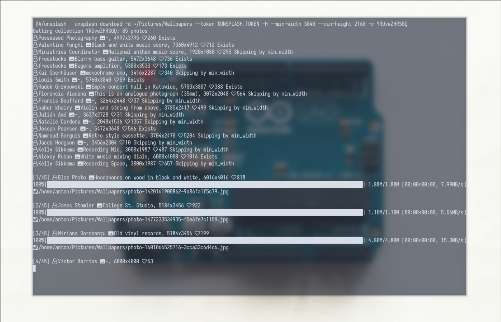

## Unsplash

CLI to download collections from Unsplash



### Features

- Filters to specify min width, min height, min likes
- Ability to filter out vertical images
- Skiping existing images

### Installation

```
pip install --user unsplash_dl
```

```
CLI to download images from unsplash.

Usage:
  unsplash
  unsplash --version
  unsplash download -c=<str> -t=<str> -d=<str> [--min-width=<int>] [--min-height=<int>] [--min-likes=<int>] [-H] [-v]

Options:
  -h --help                     Show this screen
  -v --verbose                  Enable logging
  --version                     Show version.

  -c=<str> --collection=<str>   Collection to download
  -t=<str> --token=<str>        Unsplash API token
  -d=<str> --directory=<str>    Directory to download to
  -H --ignore-vertical          Ignore vertical photos
  --min-width=<int>             Minimal width
  --min-height=<int>            Minimal height
  --min-likes=<int>             Minimal likes
```
